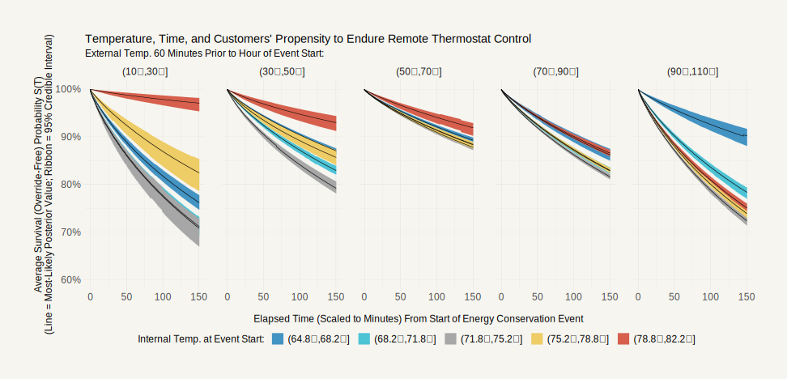

<p align="center">

</p>

## Atmospheric Temperature and Consumer Rejection of Remote Thermostat Control (Simpson, Lopez Garcia, & Schein, 2024) 

**Abstract**: Wi-Fi-enabled “smart” thermostats are thought to hold substantial potential for managing peak domestic electricity demand. But under what atmospheric conditions will a consumer accept an energy supplier’s remote control of their home heating, ventilation, and air conditioning (HVAC) system? We analysed historical data on 231,344 instances wherein Octopus Energy U.S., an electricity retailer, remotely enacted time-limited changes (≈1-150 minutes) to the heating and cooling set points of its customers’ thermostats (a sample of 1,159 Texan households; 1,834 thermostats). We show that internal temperature, external temperature, and time combine to produce a powerful gradient along which customers’ propensity to endure retailer control varies. Specifically, non-causal estimates from Bayesian multilevel models of the time until customers override their modulated set points indicate that — when external atmospheric conditions are contextually severe (i.e., 10-30˚F and 90-110˚F) — the survival (i.e., override-free) probability can fall to as low as ≈71% over the course of 150 minutes. However, results also suggest that counterbalancing external conditions by changing the internal temperature of a customer’s home prior to spells of set-point modulation (i.e., pre-cooling/heating) could see survival probabilities remain as high as ≈90-97% over 150 minutes. Definitive conclusions necessitate causal inference via field experimentation.

**Cite As:** Simpson, C. R., Lopez Garcia, D., \& Schein, A. R (2024). Atmospheric Temperature and Consumer Rejection of Remote Thermostat Control. *Octopus Centre for Net Zero*. [https://doi.org/10.5281/zenodo.12703197](https://doi.org/10.5281/zenodo.12703197)

<br>

> [!NOTE]
> The code in this replication pack is used: (a) to transform data concerning a sample of smart thermostats belonging to a subset of customers of Octopus Energy (OE); and (b) to estimate a series of survival models, both with R 4.3.3. The analysed data, which were amassed by Octopus Energy U.S. (OEUS), are from households in Texas and they are restricted — where access requires employment by the Octopus Energy Group (OEG). In addition to the R code for data munging and statistical analyses, this repository also contains the code used to produce the tables and figures in the report summarising our results. This report is open to all and it may be accessed via the DOI above.

<br>

Those seeking to reproduce our work may easily do so using a fresh virtual environment. Specifically, I (CRS) recommend the light-weight, easy-to-use [**Micromamba**](https://mamba.readthedocs.io/en/latest/user_guide/micromamba.html) which I relied on to complete the research summarised above.

Replicators who decide to use Micromamba (or other Conda-style environment/package managers), should see the environment [specification files](https://mamba.readthedocs.io/en/latest/user_guide/micromamba.html#specification-files) enclosed in this repository. These files are named **`TFlex_setup_environment.yml`** and **`TFlex_replication_environment.yml`**.

<br>

> [!IMPORTANT]
> Primers on virtual environments (in relation to both R and Python) may be found at:
> 
> - https://mamba.readthedocs.io/en/latest/user_guide/micromamba.html
> - https://andrewpwheeler.com/2022/04/08/managing-r-environments-using-conda/
> - https://pythonspeed.com/articles/conda-dependency-management/
> - https://realpython.com/python-virtual-environments-a-primer/
> - https://stackoverflow.com/questions/61536466/pips-requirements-txt-best-practice
> - https://labs.epi2me.io/conda-or-mamba-for-production/

<br>

**`TFlex_setup_environment.yml`** was used to create the virtual environment for the survival analysis. And it enumerates a general mix of R (and Python) packages required for the smart-thermostat project and other econometric analyses performed by me at Octopus Centre for Net Zero (OCNZ). 

**`TFlex_replication_environment.yml`** is a kind of expanded version of `TFlex_setup_environment.yml`. *Specifically for those packages available via ["Conda Forge"](https://anaconda.org/conda-forge)*, `TFlex_replication_environment.yml` contains complete information (e.g., version numbers) on packages and their dependencies. [Therefore, it can to be used to download the exact Conda builds included in the local virtual environment I used for the project discussed here](https://pythonspeed.com/articles/conda-dependency-management/) via the command `micromamba create --name TFlex --file=TFlex_replication_environment.yml --platform osx-64` (or similar, depending on your workflow, with "--name TFlex" being replaceable with one's preferred environment name; e.g., "--name OEUStexas").

Note well that some R and Python packages are are not available via Conda Forge. Furthermore, Conda versions may have been inappropriate for the [operating system/platform](https://mamba.readthedocs.io/en/latest/advanced_usage/more_concepts.html?highlight=platform#subdir) used for the analysis (i.e., macOS or `osx-64`). Therefore, these packages will need to be installed via the [Comprehensive R Archive Network (CRAN)](https://cran.r-project.org/web/packages/index.html) or the [Python Package Index (PyPi)](https://pypi.org). 

[Further note that the R interpreter itself is drawn from Conda Forge](https://anaconda.org/conda-forge/r-base). Thus, installation of R is handled during creation of the Micromamba virtual environment with one of the specification files via the command `micromamba create --name TFlex --file=TFlex_setup_environment.yml --platform osx-64` or `micromamba create --name TFlex --file=TFlex_replication_environment.yml --platform osx-64`.

After virtual environment creation and installation of R, packages from CRAN can be installed after subsequent [environment activation](https://mamba.readthedocs.io/en/latest/user_guide/concepts.html?highlight=platform#activation-deactivation). Installation of R packages from CRAN is easily handled using the enclosed file `TFlex_requirements.R` and by using the command line interface (i.e., "Terminal" on a Mac) to run the command `RScript TFlex_requirements.R` *after* Micromamba environment creation + activation.

Installation of Python packages not available on Conda Forge is far more straightforward. Specifically, these packages can be installed from PyPi into the replication environment via the terminal command `pip` — where, like R, [the Python interpreter and the pip package manager are drawn from Conda Forge](https://anaconda.org/conda-forge/python) via `TFlex_setup/replication_environment.yml`. *After* creation/activation of the Micromamba virtual environment, one can install PyPi packages "on-the-fly" (e.g., the regression discontinuity design package ["rdrobust"](https://pypi.org/project/rdrobust/#description)) by simply running the command `pip install rdrobust==1.2.0`. However, I simply used `TFlex_setup_environment.yml` itself to call pip to install the desired PyPi packages.

Ideally, one should first check if there is an available version of a CRAN/PyPi package on Conda Forge (or some other Conda channel). This is because Micromamba (and thus the specification file created with the command `micromamba env export > TFlex_replication_environment.yml`) does not "see" packages sourced directly from CRAN or PyPi even though they are installed after environment activation. This undermines reproducibility but it is sometimes unavoidable.

[There are alternative environment + package managers that do not suffer this limitation](https://prefix.dev/blog/pixi_a_fast_conda_alternative). Nevertheless, I (CRS) prefer Micromamba. And, to deal with this issue, requisite non-Conda Python packages and non-Conda R packages are respectively documented in `TFlex_setup_environment.yml` and `TFlex_requirements.R`. Not all of these packages (e.g., those put together by academics) have specific versions.

All in all, to recreate a local virtual environment that is ([mostly](https://mc-stan.org/docs/reference-manual/reproducibility.html)) identical to my own (platform allowing), one would run:

``` shell %% https://stackoverflow.com/a/52586193 %%
%% Create/Initiate Virtual Environment %%
micromamba config append channels conda-forge
micromamba create --name TFlex --file=TFlex_setup_environment.yml --platform osx-64
cd "PATH_TO_COPY_OF_REPOSITORY_FOLDER"
micromamba activate TFlex
micromamba env export > TFlex_replication_environment.yml 
RScript TFlex_requirements.R

%% Remove/Delete Virtual Environment %%
micromamba deactivate
micromamba env remove --name TFlex 
micromamba clean --all
```

And, once R is loaded and one has set their working directory to the folder containing all of the replication code and data, simply running **`base::source("TFlex_holds_mini_project_main.R")`** should reproduce our analysis (i.e., data transformation, model estimation, figure and table creation, in full). This will of course initiate a sequence of steps that, together, will take hours to complete (mostly due to model estimation).

<br>

> [!NOTE]
> I have left numerous comments/notes throughout the various scripts used for environment set-up and the analysis itself. It is hoped that these comments help to clarify logic and aid replicators who are not familiar with/new to programming but who still may be interested in trying to understand technical aspects of our research.
> 
> Indeed, the code in this repository is primarily written for technically-inclined (cf. fully technical) audiences of academics and policymakers curious about our research as well as less-technical colleagues across the Octopus Energy Group charged with auditing our day-to-day work. Accordingly, readability and accessibility are core aims. *Practically speaking, this means that norms/syntax/conventions preferred by those with backgrounds in computer science/software engineering are secondary, even tertiary, concerns.* 

<br>

Thank you for your interest in our research and please do contact us to ask any questions.

**Author**: Cohen R. Simpson

**Email**: cohen.simpson@centrefornetzero.org

<br>

## Summary of Files in Repository
[Unfortunately, we are unable to share the data for this project publicly due to data-protection regulation (i.e., GDPR) and concerns around commercial sensitivity](https://www.centrefornetzero.org/data-privacy-and-ethics-statement/). Accordingly, only some of the files below are available to those external to the organisation. Individuals employed by the Octopus Energy Group who wish to reproduce our work should contact us to access the internal version of this repository which includes all requisite data files.

In full, the repository contains the following files:  

1.  `README.md`
2.  `TFlex_setup_environment.yml` (YAML Specification File: Original Environment Creation)
3.  `TFlex_replication_environment.yml` (YAML Specification File: Conda Environment Replication)
4.  `TFlex_requirements.R` (R Script/Specification File: Installation of R Packages Not on Conda Forge)
5.  `Mini Project` (Folder)
6.  `TFlex_holds_mini_project_main.R` (R Script: Overarching/Master R Script Calling All Others)
7.  `TFlex_holds_mini_project_process_data_ERA5_geometry_API_credentials.R` (R Script: **Not Public**)
8.  `TFlex_holds_mini_project_process_data_ERA5_geometry.R` (R Script: Download Temperature Data)
9.  `TFlex_holds_mini_project_process_data.R` (R Script: Load Data + Process Data + Descriptive Stats)
10. `TFlex_holds_mini_project_process_tx_choropleth.R` (R Script: Create Figure - Events Over Texas)
11. `TFlex_holds_mini_project_results_estimate_models.R` (R Script: Fit Bayesian Survival Models)
12. `TFlex_holds_mini_project_results_estimates_tabular.R` (R Script: Create Table - Model Results)
13. `TFlex_holds_mini_project_results_figure_survfit_basehazfit.R` (R Script: Create Figure - Standardised Survival Curve)
14. `TFlex_holds_mini_project_results_figure_survival_fitted_values.R` (R Script: Create Figure - Standardised Survival Curves)
15. `TFlex_holds_mini_project.sql` (SQL Script: **Not Public**, Pull + Lightly Munge Records from OEUS' Database)
16. `TFlex_roster_hold_events_any_length_as_of_May_30_2024 (2024-06-06).csv` (OEUS Data: **Not Public**)
17. `TFlex_roster_hold_events_frequency_any_length_as_of_May_30_2024 (2024-06-06).csv` (OEUS Data: **Not Public**)
18. `TFlex_roster_hold_events_customer_quarter_hourly_kwh_since_Oct_2022 (2024-06-06).csv` (OEUS Data: **Not Public**)
19. `*tx_zctas_2020_geometry.rds` (Public Data From: U.S. Census Bureau via ["tigris"](https://github.com/walkerke/tigris))
20. `*tx_zctas_2020_geometry_polygon.rds` (Public Data From: U.S. Census Bureau via ["tigris"](https://github.com/walkerke/tigris))
21. `*tx_2m_temperature_ERA5_Oct_1_2022_May_30_2024_raw_NetCDF.nc` (Public Data From: European Centre for Medium-Range Weather Forecasts via ["krigR"](https://github.com/ErikKusch/KrigR))
22. `*tx_2m_dewpoint_temperature_ERA5_Oct_1_2022_May_30_2024_raw_NetCDF.nc` (Public Data From: European Centre for Medium-Range Weather Forecasts via ["krigR"](https://github.com/ErikKusch/KrigR))
23. `*ziptz_python_master_database_May2024 (2024-05-22).db` (Public Data From: ["ziptz"](https://github.com/infused/ziptz))
24. `IECC_BA_climate_zones` (Folder) (Public Data From: International Energy Conservation Code + U.S. Department of Energy Building America Programme via ["GitHub (marsha5813)"](https://gist.github.com/marsha5813/b0279b4b0261634de358fca46e61e6f3))
25. `NSAPH_zip_zcta_crosswalk` (Folder) (Public Data From: Harvard National Studies on Air Pollution and Health via ["Harvard Dataverse (Audirac, 2024)"](https://doi.org/10.7910/DVN/HYNJSZ))
26. `williams_HUD_usps_crosswalk_files_2021Q4` (Folder) (Public Data From: U.S. Department of Housing and Urban Development via ["GitHub (hantswilliams)"](https://github.com/hantswilliams/hud_usps_crosswalk_files))
27. `*TFlex_holds_mini_project_workspace (2024-07-04).RData` ([Complete R Workspace/Environment Post Data Load/Transformation + Model Estimation w/ Posterior Predictive Draws](https://stackoverflow.com/a/40862433): **Not Public**)
28. `rstanarm-feature-survival.zip` (R Software: Copy of GitHub Development Branch of ["rstanarm" that allows estimation of survival models](https://discourse.mc-stan.org/t/stan-surv-in-rstanarm/26812))

> [!CAUTION]
> To avoid resource exhaustion, if needed, please be sure to change the settings for model estimation and posterior prediction to accomodate your number of CPU cores and the amount of availiable RAM. This can be done on Lines 206-215 in `TFlex_holds_mini_project_results_estimate_models.R`. See also Lines 17-23 in `TFlex_holds_mini_project_results_figure_survfit_basehazfit.R` and Lines 9-14 in `TFlex_holds_mini_project_results_figure_survival_fitted_values.R`.

<br>

## Things to Keep In Mind
1. The Micromamba/Conda virtual environment can be activated in any directory after its creation. Therefore, please make sure to change your working directory to the folder used to sore your copy of this repository so that the file paths in the various scripts (e.g., `TFlex_holds_mini_project_process_data.R`) are valid. Along this line, do note that the scripts that call data placed inside of sub-folders (e.g., `NSAPH_zip_zcta_crosswalk`) use path names reflective of nesting. 

2. The code/analysis has been tested on macOS only. No guarantees are offered for Windows or Linux. See also, the STAN documentation (https://mc-stan.org/docs/reference-manual/reproducibility.html).

3. As opposed to generating stand-alone files, in general, the R code to create the tables (e.g., see the bottom of `TFlex_holds_mini_project_results_estimates_tabular.R`) spits out LaTeX code which was pasted (in part) into the source script used to compile our paper. Final/exact table styling was achieved using LaTeX itself.
